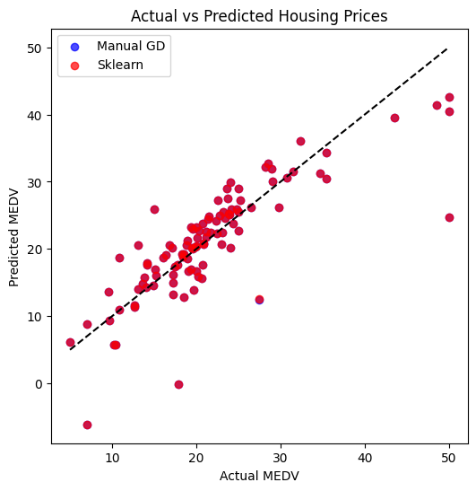

# Boston Housing Price Prediction

This project implements **Linear Regression from scratch using Gradient Descent** to predict housing prices in Boston. It also compares results with **scikit-learn’s LinearRegression** and visualizes the predictions.

---

## Dataset

We use the **Boston Housing Dataset**, containing various features (e.g., crime rate, number of rooms, accessibility to highways) to predict the median value of owner-occupied homes (MEDV).

Dataset link: [Kaggle - Boston Housing](https://www.kaggle.com/datasets/altavish/boston-housing-dataset)

---

## Features

- Manual implementation of Linear Regression
- Comparison with `sklearn`'s built-in model
- RMSE comparison for evaluation
- Actual vs Predicted price visualization

---

## RMSE Comparison

| Model                     | RMSE     |
|--------------------------|----------|
| Manual Gradient Descent  | *4.928833025553146*  |
| Sklearn LinearRegression | *4.928602182665336*  |

*(Replace with your actual RMSE values)*

---

## Visualizations

### Actual vs Predicted Prices

---

## Files

- `boston_price_prediction.ipynb` – Full implementation notebook
- `Actual_Predicted.png` – Prediction plot
- `README.md` – Project documentation
- `LICENSE` – MIT License

---

## Author

**Arya Satyanarayan Sadala**

If you found this useful, feel free to ⭐ the repo or connect on [LinkedIn](https://www.linkedin.com).

---

## License

This project is licensed under the MIT License. See `LICENSE` for more information.
